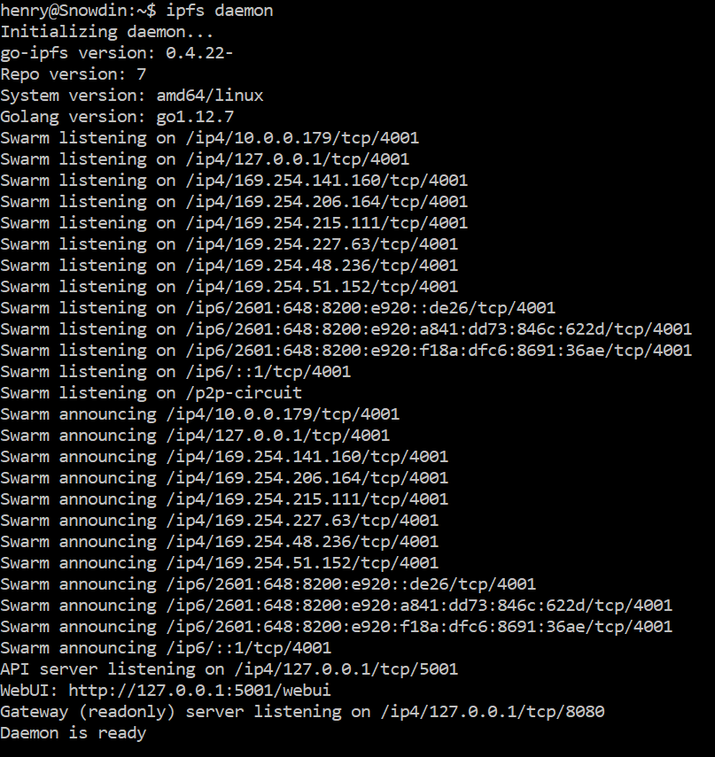
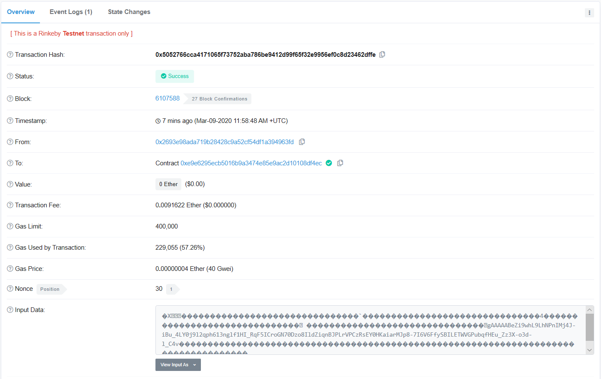

# bio2bio

## Docker

[stuartlab/bio2bio](https://hub.docker.com/repository/docker/stuartlab/posttoeth)

## Abstract

Effective data sharing empowers biological research. Here, we present Bio2Bio, a peer-to-peer system for decentralized, secure and version-controlled sharing of biological data. The Bio2Bio system, in theory, is compatible with all existing biological data types, and can be extended to new types as they emerge. Together with downstream analytical pipelines, Bio2Bio creates an extendable ecosystem for collaborative research. We further develop tools for analyzing cellular state correspondence across single cell expression datasets, as an exemplar analytical pipeline in the ecosystem.

## Installation
This is an installation guide for macOS and Linux. For Windows, go to [Windows install guide](windows_install.md).

### IPFS  
Follow the instructions to install IPFS here: https://docs.ipfs.io/guides/guides/install/#installing-from-a-prebuilt-package

Run this on first use: `$ipfs init`  
Run this to start the IPFS daemon: `$ipfs daemon` 

Alternatively, use IPFS Desktop.  

### Packages to install using python3 pip.  
* argparse
* ipfshttpclient
* web3 (You may need to update your cython to install its dependencies.)
* hexbytes
* cryptography
* pandas

#### Additional packages required to run local web app.
* flask
* json (default python library)
* contextlib (default python library)
* flask_wtf
* wtforms

### Blockchain account
Guide for getting a blockchain account to post data, using Metamask.  
1. Install Metamask for your browser. Make an account.
2. Follow the instructions here: https://www.rinkeby.io/#faucet to get tokens for use on the Rinkeby testnet.
3. Click the Metamask icon and log in to your account if required.
4. There should be a dropdown menu that says Main Ethereum network. Select Rinkeby Test Network.
5. Click "Account 1" to copy your wallet address. This is used in flag -a for postToEth.py
6. Click the menu icon (hamburger), then Details. Click Export Private Key and enter your account password to get your account private key. Copy this for use with the flag -k for postToEth.py

Now you should be able to run postToEth.py!

`python3 path/to/postToEth.py <flags>`

### Flags

optional arguments:
&nbsp;&nbsp;  -h, --help            show this help message and exit  
  &nbsp;&nbsp;--version, -v         show program's version number and exit  
  &nbsp;&nbsp;--out OUT             Location to store blockchain data, query results, downloads  
  &nbsp;&nbsp;--query               Run in query mode  
  &nbsp;&nbsp;--start START         Time query start, in YYYYMMDD format  
  &nbsp;&nbsp;--end END             Time query end, in YYYYMMDD format  
  &nbsp;&nbsp;--unencrypted         Query only unencrypted posts in subtrees  
  &nbsp;&nbsp;--new                 Query only most updated posts  
  &nbsp;&nbsp;--original            Query only posts with no valid prevHash  
  &nbsp;&nbsp;--hash HASH           Query a specific IPFS hash  
  &nbsp;&nbsp;--depth DEPTH         Query a specific tree depth, int  
  &nbsp;&nbsp;--printMetadata       Get and print metadata from IPFS for this query  
  &nbsp;&nbsp;--download DOWNLOAD   Download files associated with this hash  
  &nbsp;&nbsp;--post                Run in post mode  
  &nbsp;&nbsp;--previous PREVIOUS, -p PREVIOUS  
                        Previous submission hash  
  &nbsp;&nbsp;--doEncrypt, -e       Encrypt the IPFS hash using Fernet, default False  
  &nbsp;&nbsp;--file FILE, -f FILE  location of data to upload  
  &nbsp;&nbsp;--account ACCOUNT, -a ACCOUNT
                        wallet hash  
  &nbsp;&nbsp;--privateKey PRIVATEKEY, -k PRIVATEKEY
                        wallet private key  
  &nbsp;&nbsp;--gasPrice GASPRICE, -g GASPRICE
                        transaction gas price in gWei, default 40  
  &nbsp;&nbsp;--password PASSWORD, -w PASSWORD
                        user supplied password  
  &nbsp;&nbsp;--json                user walkthrough json for upload, default True  
  &nbsp;&nbsp;--skipEth             skip posting to Ethereum, for reposting to IPFS, default False  

## Major repository components:

contracts/  
&nbsp;&nbsp;HashStore.sol - solidity smart contract that stores information on the blockchain  
&nbsp;&nbsp;&nbsp;&nbsp;Inputs: hash (text), tag, previous hash if given  
scripts/  
&nbsp;&nbsp;postToEth.py - script that posts data to IPFS/blockchain  
app/
&nbsp;&nbsp;app.py - script that operates web app implementation of postToEth.py
&nbsp;&nbsp;&nbsp;&nbsp;templates - html webpages that comprise the app
public/  
&nbsp;&nbsp;index.html - Dapp that allows users to view files posted through this program, maintains an index of files  

Pseudocode for uploader:  

postToIPFSBlockchain(data, dataTypeTag, previousVersionHash, doEncrypt){  
&nbsp;&nbsp;&nbsp;&nbsp;key = NULL  
&nbsp;&nbsp;&nbsp;&nbsp;IPFSIndex = getIPFSIndex()  
&nbsp;&nbsp;&nbsp;&nbsp;hash = getIPFSHash(data)  
&nbsp;&nbsp;&nbsp;&nbsp;if hash in IPFSIndex:  
&nbsp;&nbsp;&nbsp;&nbsp;&nbsp;&nbsp;&nbsp;&nbsp;return ("hash found in IPFS index, this data is already posted")  
&nbsp;&nbsp;&nbsp;&nbsp;if doEncrypt:  
&nbsp;&nbsp;&nbsp;&nbsp;&nbsp;&nbsp;&nbsp;&nbsp;hash, key = encrypt(hash)  
&nbsp;&nbsp;&nbsp;&nbsp;transactionID = postToBlockchain(hash, dataTypeTag, previousVersionHash)  
&nbsp;&nbsp;&nbsp;&nbsp;return (hash, key, transactionID)  
}  
 
A Docker image file will be made available with dependencies installed.

Also, an IPFS daemon must be running in the background at ports 5001/8080.

Check out your data at these IPFS mirrors:  
ipfs.io\/ipfs\/\<Your hash here\>  
cloudflare-ipfs.com\/ipfs\/\<Your hash here\>  

View your transaction here:
rinkeby.etherscan.io

Pictures of the process:

Running the IPFS daemon:  
  
  
Running postToEth.py:  
  
  
Viewing the transaction on etherscan.io:  
  
