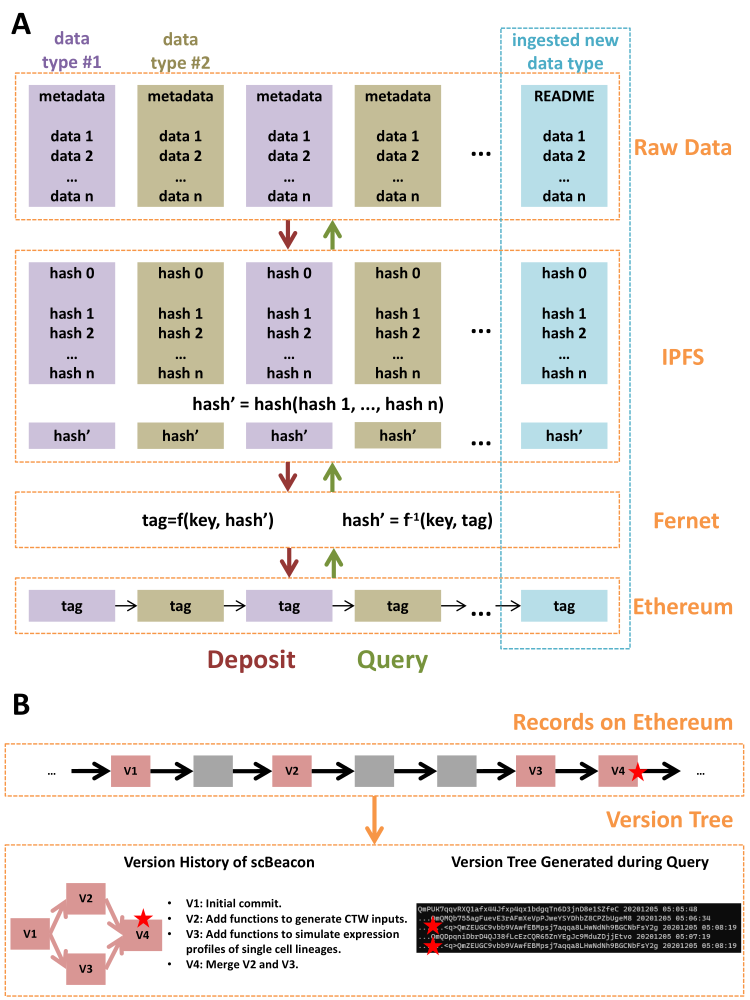
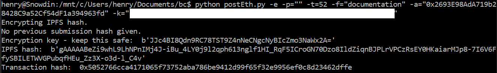

# postToEth

"Creating a data sharing platform on a blockchain allows standard algorithms to take care of data synchronization, authentication, privacy, and validation. IPFS, or Interplanetary File System, is the peer-to-peer distributed file system in which users store data.  Data are indexed using a cryptographic hash, which is a one-way function that creates a small string based on the data that can be used as a link that allows users to access the data directly from a peer that has a local instance of the data. The hash function produces drastically different, unique results even for only slightly different data. The hashes, and transactions using them, are stored on the Ethereum blockchain. A blockchain is a ledger maintained by a peer-to-peer network. Each peer keeps a copy of the network. The network is made up of a series or chain of blocks, which each store transaction data. The Ethereum blockchain further has the capability to run smart contracts, which are Turing-complete scripts that can store variables and run functions. All peers will calculate the function calls of a smart contract, and the results and variables are stored in the blockchain. This provides verification on a massive scale. Using one of these smart contracts, we store IPFS hashes of our data, and hashes of data changes and transactions, on the blockchain, providing a public, distributed index of the data with a verifiable history. Blockchain technology can provide a revolutionary mechanism for science to share results because it does not rely on an expensive and slow central trusted authority to harvest boutique datasets and serve them out to qualified members of the research community. " - Research Strategy-CEGS Research Project (proposal).

Major components of this repository:  
contracts/  
&nbsp;&nbsp;HashStore.sol - solidity smart contract that stores information on the blockchain  
&nbsp;&nbsp;&nbsp;&nbsp;Inputs: hash (text), tag, previous hash if given  
scripts/  
&nbsp;&nbsp;postToEth.py - script that posts data to IPFS/blockchain  
public/  
&nbsp;&nbsp;index.html - Dapp that allows users to view files posted through this program, maintains an index of files  

Pseudocode for uploader:  

postToIPFSBlockchain(data, dataTypeTag, previousVersionHash, doEncrypt){  
&nbsp;&nbsp;key = NULL  
&nbsp;&nbsp;IPFSIndex = getIPFSIndex()  
&nbsp;&nbsp;hash = getIPFSHash(data)  
&nbsp;&nbsp;if hash in IPFSIndex:  
&nbsp;&nbsp;&nbsp;&nbsp;return ("hash found in IPFS index, this data is already posted")  
&nbsp;&nbsp;if doEncrypt:  
&nbsp;&nbsp;&nbsp;&nbsp;hash, key = encrypt(hash)  
&nbsp;&nbsp;transactionID = postToBlockchain(hash, dataTypeTag, previousVersionHash)  
&nbsp;&nbsp;return (hash, key, transactionID)  
}  
 
A Docker image file will be made available with dependencies installed.

Dependencies of postToEth.py:
argparse
ipfshttpclient
web3
hexbytes
cryptography

Also, an IPFS daemon must be running in the background at port 5001.

How to run postToEth.py:
python postEth.py -e -p=\<Previous hash as string\> -t=\<Data tag integer\> -f=\<File or folder name to upload\> -a=\<Wallet address, for now use Rinkeby\> -k=\<Secret key for the wallet\>

Check out your data at these IPFS mirrors:
ipfs.io\/ipfs\/\<Your hash here\>
cloudflare-ipfs.com\/ipfs\/\<Your hash here\>

View your transaction here:
rinkeby.etherscan.io

Pictures of the process:
Running the IPFS daemon:

Running postToEth.py:

Viewing the transaction on etherscan.io:

